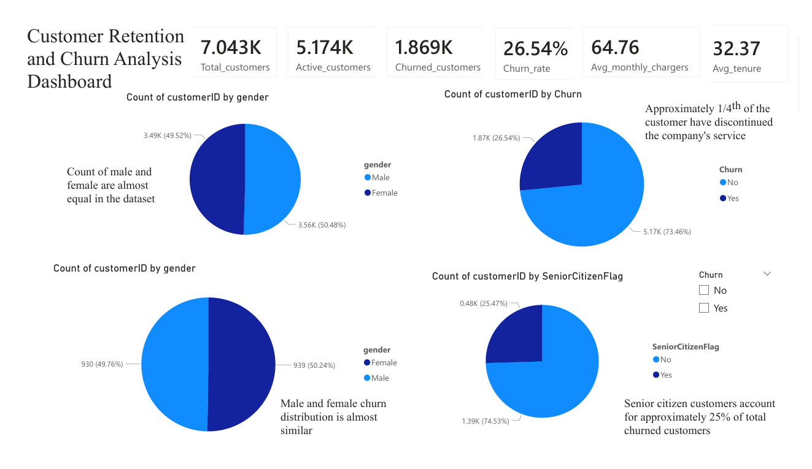
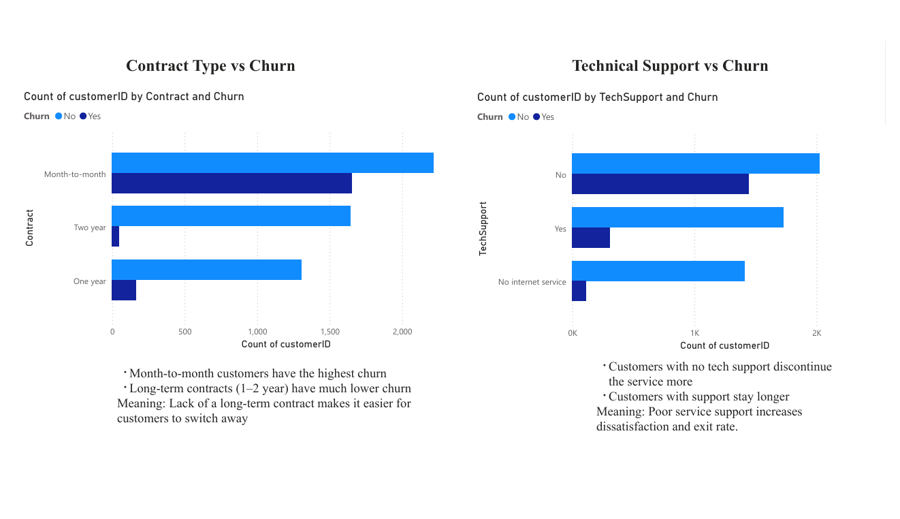
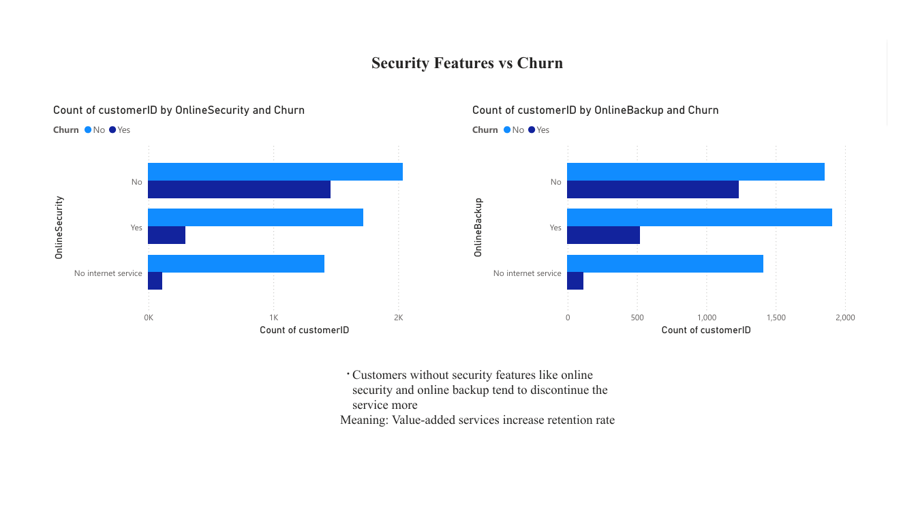
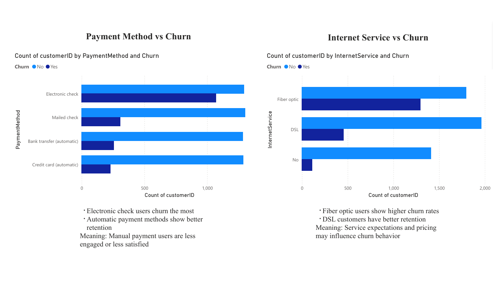
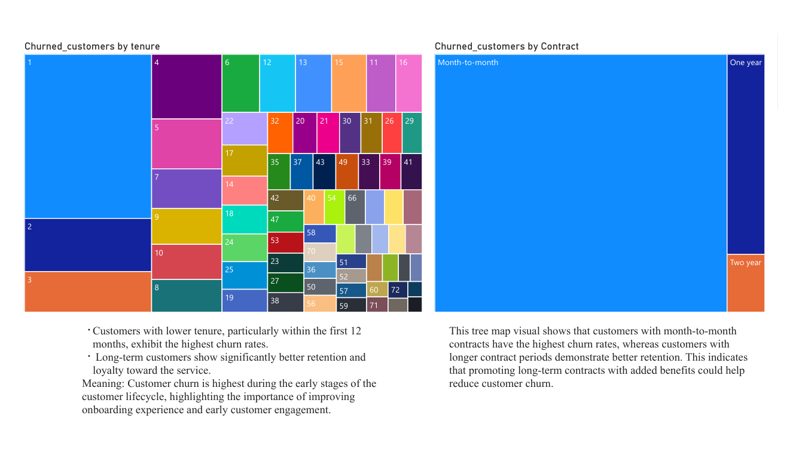
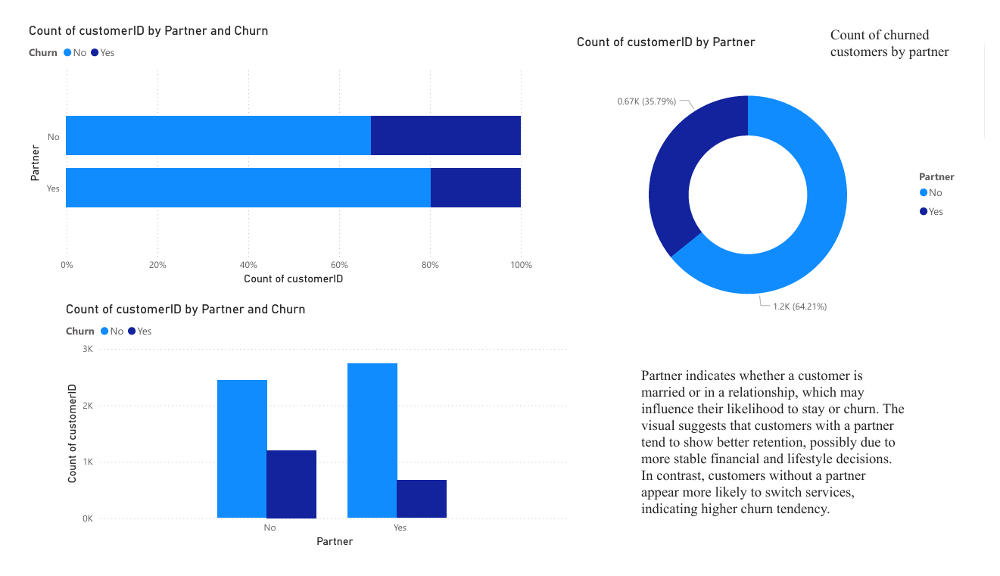
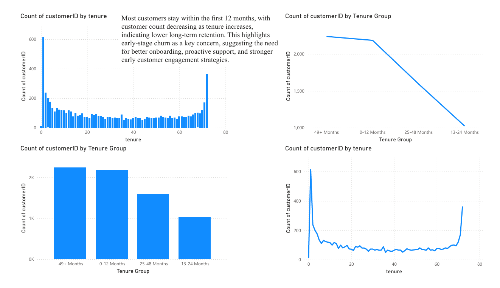
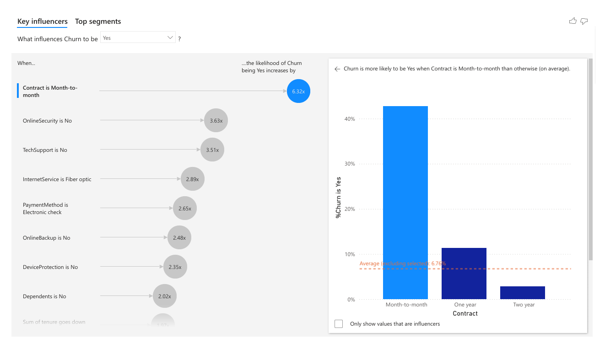
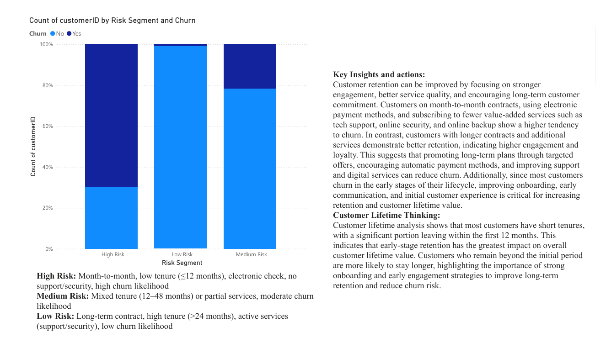

# Customer Retention and Churn Analysis

## Project Overview

This project performs a comprehensive customer churn analysis for a subscription-based telecom service. It focuses on understanding why customers leave, identifying key churn drivers, and analyzing customer behavior across different segments. The project includes data cleaning, exploratory analysis, churn segmentation, customer lifetime insights, and interactive dashboard creation to support data-driven decision-making.

---

## Dashboard Preview



















---

## Objectives

- Data Cleaning & Preparation: Clean and prepare telecom customer data for analysis  
- Exploratory Data Analysis: Understand customer patterns and relationships  
- Churn Analysis: Identify key reasons behind customer churn  
- Customer Segmentation: Segment customers based on behavior and risk level  
- Customer Lifetime Analysis: Analyze tenure and retention patterns  
- Risk Modeling: Classify customers into High, Medium, and Low risk groups  
- Visualization: Build interactive dashboards for business insights  

---

## Dataset Description

The project uses telecom customer data with key attributes:

- CustomerID: Unique identifier for each customer  
- Gender: Customer gender  
- SeniorCitizen: Whether the customer is a senior citizen  
- Partner: Whether the customer has a partner  
- Dependents: Whether the customer has dependents  
- Tenure: Number of months the customer has stayed  
- Contract: Type of contract (Month-to-month, One year, Two year)  
- PaymentMethod: Mode of payment  
- MonthlyCharges: Monthly billing amount  
- TotalCharges: Total amount charged  
- InternetService: Type of internet service  
- TechSupport: Whether tech support is subscribed  
- OnlineSecurity: Whether online security is enabled  
- OnlineBackup: Whether online backup is enabled  
- Churn: Whether the customer has left the service  

---

## Project Structure

```

Customer_Retention_and_Churn_Analysis/
├── README.md
├── Churn_Analysis.pbix
├── Churn_Report.pdf
├── Dashboard1.png
├── Dashboard2.png
├── Dashboard3.png
├── Dashboard4.png
├── Dashboard5.png
├── Dashboard6.png
├── Dashboard7.png
├── Dashboard8.png
├── Dashboard9.png
└── Datasets/
    └── Telco-Customer-Churn.csv

```

---

## Usage

### Viewing Power BI Dashboard

**Option 1: Interactive Dashboard (.pbix)**
- Open Customer_Retention_and_Churn_Analysis.pbix in Microsoft Power BI Desktop  
- Explore interactive visuals and filters  
- Analyze churn patterns by segment, tenure, and services  
- Use slicers for dynamic exploration  

**Option 2: PDF Report**
- Open Customer_Retention_and_Churn_Analysis.pdf for static viewing  
- Suitable for sharing with stakeholders  

---

## Analysis Workflow

### 1. Data Loading & Exploration
- Imported telecom customer dataset  
- Checked structure, missing values, and data types  

### 2. Data Cleaning & Preparation
- Handled missing and inconsistent values  
- Standardized categorical variables  
- Prepared churn variable for analysis  

### 3. Churn Analysis
- Identified churn distribution across customers  
- Analyzed churn rate by key attributes  
- Explored behavioral patterns of churned customers  

### 4. Customer Segmentation
- Segmented customers based on contract type, payment method, tenure, and services  

### 5. Risk Segmentation
- Classified customers into High, Medium, and Low risk groups  
- Based on behavioral and service-related factors  

### 6. Customer Lifetime Analysis
- Analyzed customer tenure distribution  
- Identified early-stage churn patterns  
- Studied long-term retention trends  

### 7. Dashboard Creation
- Built interactive visuals using Power BI  
- Added KPIs, charts, and segmentation views  

---

## Key Outputs

- Churn Distribution Analysis  
- Contract vs Churn Insights  
- Payment Method Impact  
- Service Usage Impact  
- Tenure Analysis  
- Risk Segmentation Model  
- Key Influencers Visual  

---

## Key Insights

- Most churn occurs within the first 12 months  
- Month-to-month contracts show highest churn  
- Electronic payment users churn more  
- Lack of add-on services increases churn  
- Long-term contracts improve retention  
- Early onboarding is critical for retention  

---

## Recommendations

- Improve onboarding experience  
- Promote long-term contracts  
- Encourage automatic payments  
- Bundle value-added services  
- Target high-risk customers early  

---

## Data Quality Checks

- Missing value handling  
- Duplicate removal  
- Data type validation  
- Category consistency checks  
- Churn verification  
